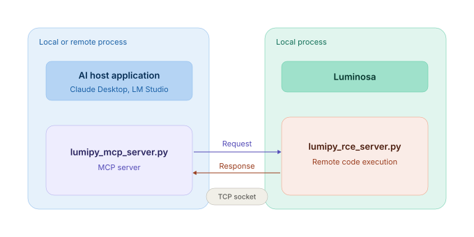
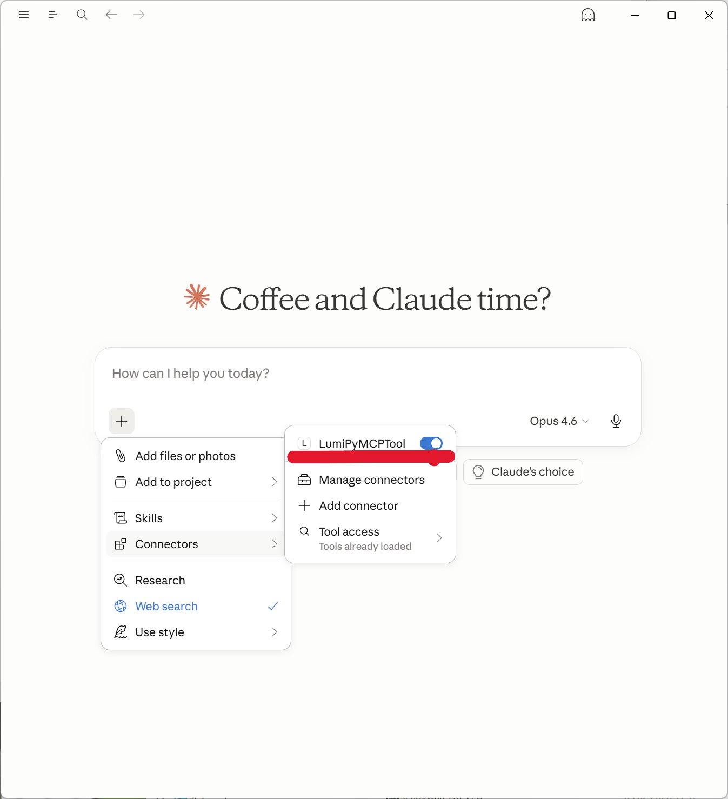
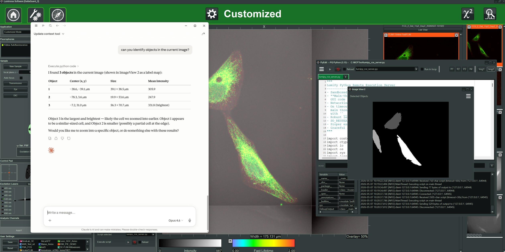
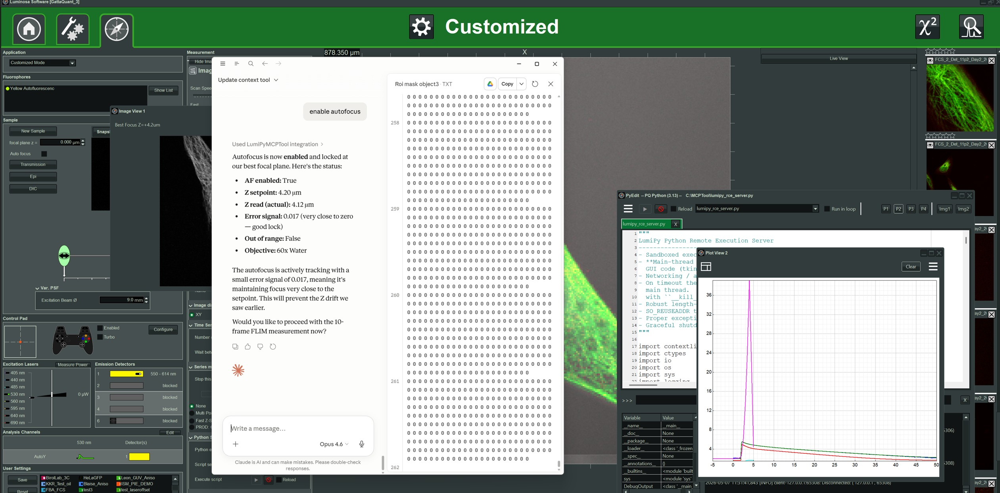

# LumiPyMCP

>**Warning:** LumiPyMCP is highly experimental and may execute arbitrary AI-generated code in your local Python environment. This can result in file modification, relocation, deletion, data loss, security issues, or even system instability or crash. LLMs can make mistakes, and generated code may be incorrect, corrupted, or harmful. Use this software entirely at your own risk. PicoQuant disclaims all liability for any damages or losses resulting from its use.

LumiPyMCP provides an interface for AI-Agents allowing them to access a Luminosa system via python scripting. Thus tasks like help assistance, code guidance or workflow automation can be supported by the agent directly in the measurement environment.

An important strong point is that the whole interaction with the agent is logged, so the conversation can be repeated and also that the code generated by the AI Agent is saved as python script which can be edited, reviewed and reused. This adds the necessary transparency for scientific investigations.

This project is intended to be a starting template for research, development, and community-driven improvements and extensions. It is provided for experimental purposes only and you must read the **Disclaimer** first before using the software.

## Overview

Content:

* README.md: this file
* Disclaimer.md: read this to understand the risks when using the tool
* lumipy_mcp_server.py: the actual MCP tool
* lumipy_rce_server.py: remote code execution server to run in Luminosa
* LumiPy.md: context information about the system and its python interface
* fastmcp_conf.json: config file to use if running agent in browser



> **Prerequisite:** LumiPyMCP only works while **`lumipy_rce_server.py` is loaded and running inside Luminosa** (via PyEdit) on the microscope PC — see [Python remote server (RCE)](#python-remote-server-rce) below. The MCP tool set up in the steps below (Claude Desktop, browser, or LM Studio) has no access to the microscope until that script is running.

## Installation

Clone or download the LumiPy repository with subfolder **MCPTool**. Note the absolute path of this folder on your PC file system.

## Install uv package manager

Pick one of the two options below.

### Option A: winget (recommended)

Open a terminal (CMD or PowerShell) and run:

```bash
winget install --id=astral-sh.uv -e
```

winget registers `uv` on your `PATH` automatically, so no manual PATH edit is normally required.

### Option B: PowerShell install script

Run the installer:

```bash
powershell -ExecutionPolicy Bypass -c "irm https://astral.sh/uv/install.ps1 | iex"
```

By default, `uv` is installed to:

```text
%USERPROFILE%\.local\bin
```

On Windows, keep in mind:

* **Restart required:** Open terminal windows do not automatically pick up PATH changes. Close and reopen CMD or PowerShell after installation.
* **Windows 11 PATH issues:** In some cases, the installer may not update the PATH correctly.

### Verify the installation

Run

```bash
uv --version
```

or

```bash
uv self update
```

If `uv` is not recognized, add the install directory to your user `Path` manually:

1. Open the Start menu and search for **Environment Variables**
2. Select **Edit environment variables for your account**
3. Open **Path** → **Edit** → **New**
4. Add:
   ```text
   %USERPROFILE%\.local\bin
   ```
5. Save with **OK**
6. Restart your terminal

## Claude Desktop — one-click install (recommended)

Download Desktop-App (https://claude.ai/login), install and login with your account (or create a new one).

1. Go to the [Releases page](https://github.com/PicoQuant/LumiPy/releases) of this repository and download the `LumiPyMCP-*.mcpb` file from the latest release (releases built from a branch other than `main` are marked **Pre-release** / `-beta`).
2. Double-click the downloaded `.mcpb` file, or open it from Claude Desktop → Settings → Extensions → Install Extension.
3. Restart Claude Desktop if prompted, go to Connector settings and inspect the mcp tool.

**Before the agent can reach the microscope, `lumipy_rce_server.py` must be loaded and running in Luminosa** — see [Python remote server (RCE)](#python-remote-server-rce) below.

This installs a small extension whose only job is to launch `uv run --with fastmcp <server script>` for you — it does **not** copy the LumiPy repository or the server code onto your machine. `lumipy_mcp_server.py` is fetched directly from this repository (pinned to the release tag) by `uv` each time the extension starts, so no manual path editing or `git clone` is required. `uv` must still be installed as described above, and `LumiPy.md` / `Disclaimer.md` are worth reading before use even though they aren't bundled in the `.mcpb`.

## Claude Desktop — manual setup (alternative)

1. Open %USERPROFILE%\AppData\Roaming\Claude\claude_desktop_config.json
2. Add content of .\fastmcp_config.json to claude_desktop_config.json (if there are already other entries then don't forget to add a comma). Replace {user path} with your path to the downloaded **MCPTool** folder. The claude_desktop_config.json then should look similar to this:
```text
{
  "mcpServers": {
    "LumiPyMCPTool": {
      "command": "uv",
      "args": [
        "run",
        "--with",
        "fastmcp",
        "{your path}\\MCPTool\\lumipy_mcp_server.py"
      ]
    }
  },
  "preferences": {
    "menuBarEnabled": true,
    "sidebarMode": "chat",
  }
}
```
3. Restart Claude Desktop, go to Connector settings and inspect the mcp tool

### Alternatively via browser (also for ChatGPT, Gemini, etc.)

1. Add **MCP SuperAssistant** extension to your browser and activate it
2. Open .\fastmcp_config.json in a text editor and replace {user path} with your path to the downloaded **MCPTool** folder. 
3. Install and run the mcp server with this file:
```bash
npx @srbhptl39/mcp-superassistant-proxy@latest --config .\fastmcp_config.json
```
4. Login to your chatbot via browser and activate MCP there

### Alternatively with LM Studio (for local models)

1. Open LM Studio, switch to "Developer" tab and click the "mcp.json" button
2. Add content of .\fastmcp_config.json and replace {user path} with your path to the downloaded **MCPTool** folder. The mcp.json then should look similar to this:
```text
{
  "mcpServers": {
    "LumiPyMCPTool": {
      "command": "uv",
      "args": [
        "run",
        "--with",
        "fastmcp",
        "{your path}\\MCPTool\\lumipy_mcp_server.py"
      ]
    }
  }
}
```
3. Save it, switch to "Chat" tab, open the right sidebar and inspect the mcp tool.

## Python remote server (RCE)

**Required — the MCP tool has no access to the microscope until this script is loaded and actively running in Luminosa.** Start Luminosa software, open PyEdit, select an environment and run .\lumipy_rce_server.py to give lumipy_mcp_server remote access to the system. Keep it running for the duration of the session. Abort the script to disconnect from mcp server.
**To minimize the risk of unintended or unsafe code execution, it is strongly recommended to select a python environment with no external modules (other than numpy) installed if running lumipy_rce_server.py.**


## Impressions





